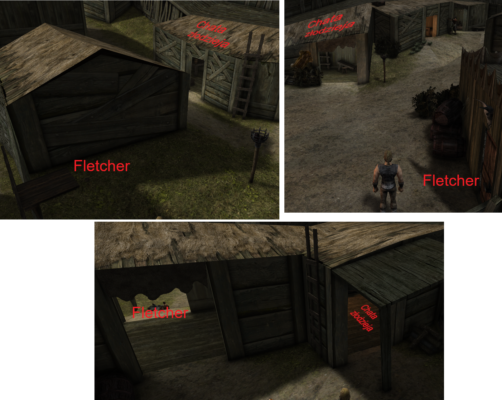
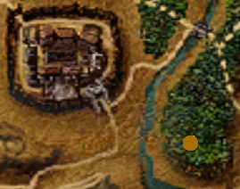
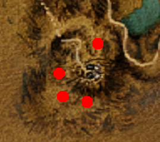
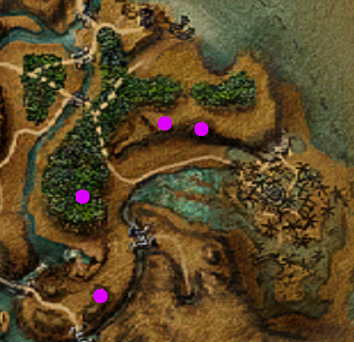
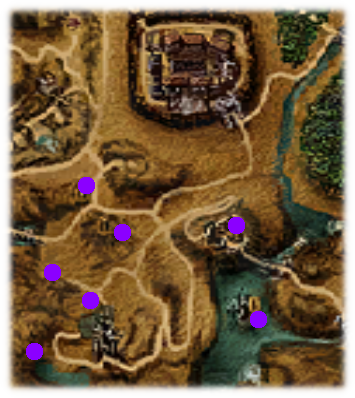
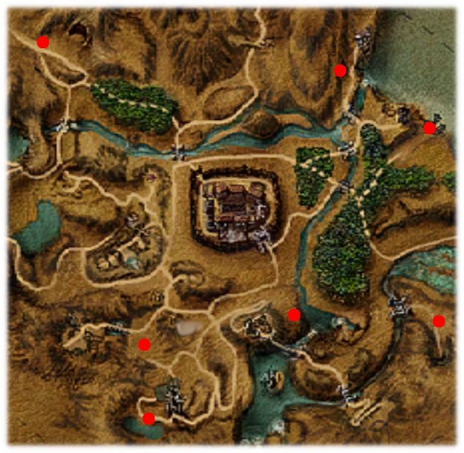
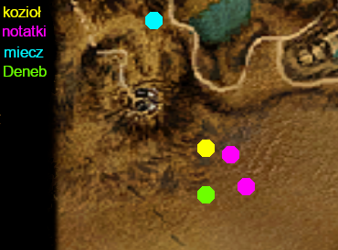

# Część 1 - Górnicza Dolina 

### Ważne informacje!
- Kradzież kieszonkowa jest potrzebna w kilku zadaniach, więc warto się jej nauczyć jak najszybciej.
- Nie zaleca się picia Esencji siły ani Esencji zręczności. W Varancie można nauczyć się wytwarzania z nich Napojów potęgi.
- za zjedzenie 5 plastrów miodu dostaniemy +5PN.
- za wykonanie [Misja ratunkowa](#misja-ratunkowa) otrzymamy przenośny stół alchemiczny. Warto zgodzić się na pomoc.
- za wykonanie [Zaginiony brat](#zaginiony-brat) zdobędziemy pierścień teleportacji w najważniejsze miejsca w Kolonii.
- warto nauczyć się górnictwa od Swineya, może być przydatne w późniejszym etapie rozgrywki.

### Moja własna ścieżka
__Zleca: Diego__

W pierwszej rozmowie Diego mówi nam, że są osoby, które zdecydowały się wieść życie samotnika. Na Placu Wymian możemy spotkać śmiejących się strażników nad ciałem kopacza, który popełnił samobójstwo. Musimy go przeszukać i przeczytać notatkę z jego przemyśleniami.

Idąc dalej, możemy porozmawiać kolejno z Orrym, Maią, Ratfordem i Draxem. W późniejszym etapie na ten temat rozmawiamy również z Gilbertem, Cavalornem oraz Aidanem.

Ostatecznie, wykonując zadanie [Uprzejmy złodziej](#uprzejmy-złodziej), poznajemy Regulusa. Po rozmowie z nim misja zostaje zakończona. Dodatkowy wpis możemy uzyskać od Sadalsuuda, ale dopiero po dołączeniu do Regulusa.

### Dziwna rzecz
__Zleca: -__

Mijając posterunek strażników i kierując się kawałek prosto, przy skrzyni możemy znaleźć fragment pancerza. Idąc dalej w górę drogi, przy wejściu do kopalni spotkamy Maię, której oddajemy fragment. Za przekazanie płytki otrzymamy nóż.

### Zaginiona siostra
__Zleca: Maia__

Maia opowiada nam, że przybyła do Kolonii w poszukiwaniu swojej siostry. Pierwszą osobą, która może coś wiedzieć na ten temat, jest Gilbert (po wykonaniu zadania [Zioła nasenne](#zioła-nasenne)). Odsyła nas on do Gravo. Dodatkowo możemy wypytać strażników pilnujących przejścia na ziemie orków, wybierając opcję dialogową „Zaskoczyło mnie to…”.

Od Gravo dowiadujemy się, że coś mogą wiedzieć Cienie. W związku z tym rozmawiamy ze Złym, Rączką oraz Świstakiem (wymagane jest wcześniejsze wykonanie ich zadań). Po rozmowie ze Świstakiem musimy spotkać się z nim w godzinach 23:30–4:30.

Po zebraniu informacji wracamy do Mai i przekazujemy jej wszystko, czego się dowiedzieliśmy. Następnie udaje się ona do Nowego Obozu. Jeśli zdobyliśmy chatę Krzykacza, możemy zaproponować jej zamieszkanie w niej.

Na tym etapie należy wykonać zadania [Infiltrator](#infiltrator) oraz [Uprzejmy złodziej](#uprzejmy-złodziej). Po ich ukończeniu możemy poprosić Regulusa o pomoc.

W trakcie wykonywania misji [Droga do zamku](#droga-do-zamku) uwalniamy Meropę i wracamy do kryjówki Regulusa. Po poznaniu jej stanu udajemy się z wiadomością do Mai.

Opcjonalnie możemy udać się do Gilberta po amulet odwagi. Warto także porozmawiać z Lee, a następnie z Aldebarem, który stoi przy drodze niedaleko Lewusa.

### Uprzejmy złodziej
__Zleca: Gor Na Drak__

Przy obozowisku Draxa i Ratforda spotykamy Gor Na Draka, który został okradziony. Rozmawiamy z Draxem, który kieruje nas do Gilberta. Jeśli przyznamy się Gilbertowi, że przysłał nas Drax, otrzymamy dodatkowe zadanie ([Skóry dla Gilberta](#skóry-dla-gilberta)) oraz więcej informacji.

Następnie udajemy się kolejno do: Aidana, Jarvisa, Baal Kagana, Kosy, Wilka, Lee oraz Cavalorna.

Po zebraniu informacji możemy udać się w stronę orkowej areny. Przed drzwiami znajdziemy zwój przemiany w chrząszcza. Używamy go, aby przedostać się pod drzwiami do kryjówki Regulusa.

Regulus daje nam nową zbroję oraz miecz i wysyła z powrotem do Gor Na Draka. Na miejscu mamy trzy możliwości: oddać wyposażenie, skłamać, że Regulus nie żyje (zadanie zostaje niezaliczone) lub powiedzieć, że Regulus został najemnikiem orków. Niezależnie od wyboru wracamy z informacją do Regulusa.

### Mapy dla Ratforda
__Zleca: Ratford__

Ratford potrzebuje mapy Kolonii. Jedną z nich można ukraść ze skrzyni Grahama. Ewentualnie można mu zanieść mapę Saturasa. Mapa drogi do starej kopalni oraz mapa Y’beriona nie nadają się, ale zapewniają dodatkowe punkty doświadczenia.

### Mapa orkowych terenów
__Zleca: Graham__

Zadanie można rozpocząć między godziną 12:00 a 15:00.

Polega ono na podążaniu za Grahamem przez tereny orków. Po powrocie należy odczekać do następnego dnia, aby odebrać od Grahama mapę oraz nagrodę.

### Dłużnik
__Zleca: Fletcher__

Fletcher ma dług u Scatty’ego, który pomagamy mu spłacić. W tym celu udajemy się na bagna do Melvina i przekazujemy mu pozdrowienia od Fletchera. Na miejscu stajemy przed wyborem:

„To za mało.” → Melvin wskazuje nam miejsce z dobrym ekwipunkiem na start. Znajdującą się tam roślinę możemy sprzedać Fortuno za 300 bryłek rudy, a od Fletchera otrzymamy dodatkowe 200.

„Umowa stoi.” → Otrzymujemy bezpośrednio 200 bryłek od Melvina oraz 300 od Fletchera.

Po zebraniu brakujących 500 bryłek rudy zanosimy całość do Scatty’ego, a następnie wracamy do Fletchera. Ten informuje nas, gdzie ukrył miecz. Niestety, we wskazanej skrzyni broni już nie ma. Wracamy do Fletchera.

Choć lokalizacja skrzyni jest stała, złodziej zmienia się w zależności od miejsca rozmowy z Fletcherem. Potencjalnych złodziei jest tylko trzech, więc nawet jeśli nie zapamiętamy miejsca rozmowy, możemy sprawdzić każdego z nich. Miecz można odzyskać poprzez kradzież lub walkę.

Po odzyskaniu broni wracamy do zleceniodawcy, kończąc zadanie.

### Niespodziewany gość
__Zleca: Nowicjusz__

Obok Baal Cadara zaczepiają nas dwaj nowicjusze, którzy opowiadają o mężczyźnie zajmującym ich chatę. Znajdziemy go niedaleko chaty Caine. Po rozmowie zgodzi się ją opuścić, jednak musimy znaleźć mu nowe lokum. Odpowiednią opcją okaże się chata wskazana przez Guya w Starym Obozie. Informację przekazujemy Altarfowi, który przebywa w chacie obok Fortuno.

Po zaprowadzeniu go na miejsce wracamy na bagna do nowicjuszy. Następnie możemy odwiedzić Altarfa w Starym Obozie, gdzie dowiadujemy się, że przeprowadził gruntowny remont i nie odpowiada mu ta chata. Musimy więc znaleźć mu inne mieszkanie. Tym razem będzie to chata Krzykacza, do której go odprowadzamy.

Po kilku dniach, wchodząc do obozu, zagaduje nas Jarvis. Musimy udać się do byłej chaty Krzykacza, gdzie przed wejściem zastajemy tłum najemników z Lee na czele. Po krótkiej rozmowie ponownie odprowadzamy Altarfa na bagna.

Na tym etapie zadanie rozgałęzia się na dwie ścieżki:

- jeśli spotkamy nowicjuszy w chacie, Altarf zamieszka obok Fortuno, a po kilku dniach zleci nam zadanie [Atak węży błotnych](#atak-węży-błotnych)

- jeśli ich nie spotkamy, Altarf zamieszka w ich chacie, a po kilku dniach zleci nam zadanie [Zatrute ziele](#zatrute-ziele)

Niezależnie od sytuacji, misja dobiega końca.

### Atak węży błotnych
__Zleca: Altarf__

Altarf mówi nam, że błotne węże ostatnio pożarły kilku nowicjuszy. Po więcej informacji udajemy się do Baal Oruna, który kieruje nas do Gor Na Rana. Gor Na Ran prosi nas o dobicie rannego węża, którego znajdziemy na bagnach przy orkowej lampie. Na miejscu znajdujemy również martwych nowicjuszy oraz notatkę przy jednym z ciał. Czytamy ją, a następnie wracamy do Gor Na Rana i później do Baal Oruna, co kończy misję.

### Zatrute ziele
__Zleca: Altarf__

Altarf mówi nam, że w obozie pojawiło się szkodliwe bagienne ziele. Po więcej informacji udajemy się do Baal Oruna, który informuje nas, że jeden z nowicjuszy już zmarł przez to ziele. Jego ciało znajdziemy na bagnie w pobliżu orkowej lampy. Przeszukujemy je, zabieramy notatkę, czytamy ją, a następnie zanosimy do Baal Oruna, co kończy zadanie.

### Skóry dla Gilberta
__Zleca: Gilbert__

Jeśli przyznamy się Gilbertowi, że Drax powiedział nam, gdzie go szukać, zleci nam przyniesienie 3 wilczych skór. Skóry możemy pozyskać z misji [Mapy dla Ratforda](#mapy-dla-ratforda) lub samodzielnie, polując na wilki (pamiętając o wcześniejszej nauce skórowania).

### Zioła nasenne
__Zleca: Gilbert__

Gilbert prosi nas o zaniesienie ziół dla Gravo. Po ich dostarczeniu otrzymujemy jedzenie dla Gilberta, które następnie mu odnosimy.

### Banda Quentina
__Zleca: Notatka szantażysty__

Zabijając szantażystów na moście prowadzącym do Nowego Obozu, możemy zabrać z jednego z nich notatkę. Po jej przeczytaniu udajemy się do obozu Quentina, który zleca nam zaniesienie listu do kotła w Wolnej Kopalni dla Calasha.

Jeśli otworzymy list i zapoznamy się z jego treścią, możemy wrócić do Quentina i poinformować go o tym. Wówczas zleci nam nowe zadanie. Musimy zdobyć znak bractwa. Jeden z nich znajduje się w skrzyni Kaloma. Po jego zdobyciu odnosimy go do Quentina.

Następnie udajemy się do Gilberta po duplikat klucza, który otrzymujemy bez problemu, po czym oddajemy go zleceniodawcy. Kolejnym krokiem jest uwolnienie Alexa z więzienia. W tym celu potrzebujemy mapy Starego Obozu, którą sprzedaje Graham. Wchodzimy do lochów, otwieramy drzwi i wyprowadzamy Alexa.

Na końcu wracamy do Quentina, aby zakończyć zadanie.

### Nosiwoda w służbie Lewusa
__Zleca: Lewus__

Lewus chce, żebyśmy zanieśli wodę zbieraczom ryżu.

Jeśli wcześniej rozmawialiśmy ze Spiką, możemy powiedzieć mu: „Spika powiedziała, żebyś ochłonął z tą wodą.” Wtedy Lewus zostawi nas w spokoju.

Podczas wykonywania zadania [Zamieszki na polu ryżowym](#Zamieszki-na-polu-ryżowym) możemy go pobić i ponownie z nim porozmawiać, co kończy zadanie.

### Zapracowana kobieta
__Zleca: Spika__

Gdy tylko wejdziemy do Nowego Obozu, zagaduje nas Spika. Misja ma charakter czysto informacyjny i zostaje zakończona po wykonaniu wszystkich zadań dla niej.

### Worki pszenicy
__Zleca: Spika__

Spika zleca nam kradzież worków ze zbożem ze składowiska zamku w Starym Obozie. Dostaniemy się tam podczas misji [Droga do zamku](#droga-do-zamku). Zebrane worki należy odnieść do zleceniodawcy.

Jeśli przyniesiemy więcej niż 7 worków, otrzymujemy dodatkową nagrodę w postaci Esencji Siły.

### Zamieszki na polu ryżowym
__Zleca: Spika__

Jeśli spotkamy Spikę u Jeremiasza, zleci nam rozprawienie się z Ryżowym Księciem. W pierwszej kolejności rozmawiamy z Jeremiaszem, który odsyła nas do Horacego.

Po rozmowie z Horacym, udajemy się do Księcia. Po rozmowie z Ryżowym Księciem będziemy zmuszeni stoczyć walkę z nim oraz Lewusem.

Po zwycięstwie rozmawiamy z Ryżowym Księciem i jego bandytami. Następnie wracamy do Spiki, a na końcu ponownie udajemy się do Horacego.

### Bimber jak dawniej
__Zleca: Spika__

Zadanie dostępne po ukończeniu [Zamieszki na polu ryżowym](#zamieszki-na-polu-ryżowym).

Jeśli spotkamy Spikę u Jeremiasza, poprosi nas o przyniesienie 15 alkojagód. Najwięcej tych roślin znajdziemy w górach, w okolicach Wolnej Kopalni.

Po zebraniu roślin wracamy do zleceniodawcy. Następnie musimy odczekać 2 dni i ponownie porozmawiać ze Spiką.

### Szpital polowy
__Zleca: Spika__

Jeśli spotkamy Spikę w szpitalu, zleci nam udanie się do Wolnej Kopalni. Tam najpierw rozmawiamy z Okylem, a następnie z Saifem.

Podczas prowadzenia Kreta do szpitala natkniemy się na ciało, które musimy przeszukać i zabrać kieł. Następnie wracamy do Spiki.

Teraz mamy dwa wybory:

Postępowanie zgodnie z poleceniem Spiki:
Idziemy do Alistaira, a następnie do Wilka. Potem udajemy się do Jarvisa i rozmawiamy ze Szkodnikami przy bramie. Następnie odwiedzamy Aidana i wracamy do Jarvisa. Kolejnym krokiem jest plac Corda, pytamy najemnika o Corda. W szpitalu odnajdujemy Corda, a Spika znajduje się na półce skalnej naprzeciwko szpitala. Po rozmowie z nią wracamy do Alistaira, Vindemiatrixa i Corda.

Śledzenie Spiki (lepsza opcja):
Biegniemy za Spiką, zatrzymuje nas Jarvis, następnie rozmawiamy z nią przy Aidanie i rozmawiamy z samym Aidanem, po czym wracamy do Jarvisa. Dalej udajemy się na plac Corda i pytamy najemnika o Corda. Idąc dalej, spotykamy go. Następnie odnajdujemy Spikę na półce skalnej po prawej stronie i zabijamy warga. Po wszystkim wracamy do szpitala, rozmawiamy ze Spiką i kończymy misję. Ta ścieżka odblokowuje również dodatkowe zadanie [Najlepszy przyjaciel człowieka](#Najlepszy-przyjaciel-człowieka). Warto też porozmawiać z Alistairem i Cordem.

Niezależnie od wyboru, misja zostaje zakończona.

### Naprawa młynów
__Zleca: Spika__

Jeśli spotkamy Spikę przy młynach, zleci nam ich naprawę. W pierwszej kolejności należy wejść na oba młyny i pociągnąć za dźwignie. Następnie schodzimy na dół i rozmawiamy ze Spiką, która wyśle nas do Starej Kopalni po koło zębate.

Lokacji koła zębatego jest 5 i każda jest wybierana losowo (kiedyś będzie mapa). Możemy również zapytać go o zębatkę, choć nie jest to konieczne. Po zdobyciu koła wracamy do Spiki i naprawiamy oba młyny.

### Robotnik od zaraz
__Zleca: Spika__

Jeśli spotkamy Spikę w wodnym młynie, poprosi nas o znalezienie rzemieślnika w Starym Obozie. Okazuje się, że odpowiednią osobą jest Kyle, jednak potrzebuje on narzędzi.

Aby je zdobyć, musimy ukraść klucz Bullitowi, a następnie otworzyć jego skrzynię. Z narzędziami wracamy do Kyla. Jeśli posiadamy pierścień teleportacji, możemy mu go przekazać, co pozwoli zaoszczędzić czas.

Następnie udajemy się do Nowego Obozu i rozmawiamy z Kylem oraz Spiką, co kończy zadanie.

### Wsparcie dla biedoty
__Zleca: Spika__

Jeśli spotkamy Spikę przy chatach zbieraczy między godziną 22:00 a 01:30, zleci nam zdobycie 100 sztuk mięsa oraz 70 wilczych skór.

Surowce możemy zdobyć samodzielnie lub skorzystać z pomocy myśliwych:

- Aidan daje nam 20 sztuk mięsa oraz ma na sprzedaż 10 skór za 150 bryłek rudy. Warto powiedzieć mu, że nie mamy rudy, wtedy zleci nam krótkie zadanie i przekaże 15 skór za darmo. Aby je zdobyć, musimy udać się do starej krypty i przynieść mu stamtąd notatkę.
- U Ratforda i Draxa otrzymamy 10 sztuk mięsa, ponieważ jakaś bestia żeruje na ich terenie. Musimy ją zabić. Znajdziemy ją w tunelu prowadzącym do Starej Kopalni. Po jej pokonaniu i zebraniu trofeów wracamy do Draxa, który daje nam 20 skór za darmo. Dodatkowo możemy kupić u niego 30 skór za 400 bryłek rudy.
Po dwóch dniach możemy odebrać od myśliwych dodatkowe 40 sztuk mięsa.
- Mięso można także kupić u Cavalorna.

Po zebraniu wymaganej ilości mięsa i skór zanosimy je Spice, co kończy zadanie.

### Rozszerzenie działalności
__Zleca: Spika__

Jeśli obudzimy Spikę w wodnym młynie między godziną 01:30 a 04:00, zleci nam kolejne zadanie.

Musimy udać się do Jacko, który przebywa przed Nowym Obozem. Zleci nam on zdobycie dwóch receptur: „Zew Nocy” oraz „Mrok Północy”.

Recepturę „Zew Nocy” posiada Baal Orun, musimy ją ukraść.
Recepturę „Mrok Północy” znajdziemy w laboratorium Kaloma, również trzeba ją wykraść.

Po zdobyciu obu receptur zanosimy je do Jacko. Następnie odczekujemy 2 dni i ponownie z nim rozmawiamy. Otrzymamy od niego nowy skręt „Zew Życia”, który zwiększa maksymalne punkty życia o 5.

Po wypaleniu skręta rozmawiamy z Jacko i odbieramy paczkę, którą należy zanieść Spice, co kończy zadanie.

### Najlepszy przyjaciel człowieka
__Zleca: Spika__

Jeśli w misji [Szpital polowy](#szpital-polowy) zabijemy warga, będziemy musieli znaleźć dla Spiki nowego zwierzaka.

W wyznaczonym miejscu na mapie znajdziemy psa, któremu należy dać surowe mięso. Następnie prowadzimy go do Spiki, aby zakończyć zadanie.

### Starzec
__Zleca: Spika__

Spika informuje nas, że ze szpitala zniknął starszy mężczyzna. Po więcej informacji udajemy się do Regulusa.

Dowiadujemy się od niego, że Sadalsuuda należy szukać w pobliżu zbiorników wodnych, a w szczególności przy wodospadach.

Mężczyznę znajdziemy na szczycie zatopionej wieży Xardasa. Po rozmowie z magiem wracamy do Spiki, co kończy zadanie.

### Mapa Starego Obozu
__Zleca: Strażnik bramy w Starym Obozie__

Strażnicy wiedzą, że zaprowadziliśmy Kyle'a do Nowego Obozu, dlatego musimy przynieść im mapę należącą do zwiadowcy ze Starego Obozu. Mamy na to jeden dzień.

Ciało zwiadowcy znajdziemy w lesie obok Starej Kopalni, niedaleko jaskini z zębaczami.

Po dostarczeniu mapy strażnikowi zadanie dobiega końca.

### Zbieracz Horacy
__Zleca: Horacy__

Horacy, zbieracz ryżu z Nowego Obozu, może nauczyć nas, jak skuteczniej zadawać ciosy. Wykonanie tego zadania staje się dostępne dopiero w trakcie wykonywania [Zamieszki na polu ryżowym](#zamieszki-na-polu-ryżowym).

### Nieprzespane noce
__Zleca: Swiney__

Swiney zleca nam pozbycie się rzadkiego ścierwojada, który zadomowił się w górach Wolnej Kopalni. Jego lokalizacja jest losowa. Na poniższej mapie zaznaczono cztery możliwe miejsca jego występowania. Po jego zabiciu i zebraniu mięsa wracamy do zleceniodawcy.

### Broń Baloro
__Zleca: Baloro__

Regulus ostrzega nas przed Baloro, jednak mimo to możemy się do niego udać i przyjąć zadanie. Nie powinniśmy jednak oddawać mu przedmiotów z własnej kieszeni. Zamiast tego wracamy do Regulusa po odpowiednią paczkę. Po dostarczeniu jej Baloro informujemy o wszystkim Regulusa.

Następnie możemy udać się do szpitala i spotkać Baloro w wychodku.

### Bestia
__Zleca: Kaus__

Podczas pierwszej rozmowy z Kausem opowiada nam on o tajemniczej bestii, którą widział tylko raz. Aby pomóc mu w polowaniu, musimy najpierw wykonać dla niego szereg zadań.

Po ukończeniu ostatniego z nich ([Magiczne monstrum](#magiczne-monstrum)) możemy ponownie zapytać go o polowanie. Kaus uda się wtedy do lasu za rzeką (idąc ze Starego Obozu w stronę bagien). Będzie czekał na drzewie.

Musimy mieć przy sobie co najmniej 2 demoniczne grzyby. Wchodzimy na drzewo i rozmawiamy z myśliwym. Następnie kładziemy grzyby przy mięsie (znajduje się ono na wprost, przy krzakach, w kierunku, w którym patrzy Kaus). Wracamy do niego i czekamy do wieczora.

Kolejnym krokiem jest zdobycie dodatkowych 4 demonicznych grzybów oraz udanie się do Wilka po przynętę. Po powrocie i rozmowie z Kausem przygotowujemy dwie kolejne przynęty, a następnie ponownie z nim rozmawiamy. Czekamy do wieczora, po czym pojawią się trzy opcje dialogowe:

- „No, uderz mnie idioto.” → walka na śmierć, zadanie niezaliczone
- „Och, naprawdę?!” → pojawia się bestia (najlepszy wybór)
- „To pocałuj mnie w dupę!” → kłótnia, zadanie niezaliczone

Jeśli dojdzie do walki z bestią i ją wygramy, a Kaus przeżyje, możemy odwiedzić go później w karczmie w Nowym Obozie. Dowiemy się tam, że został handlarzem i skupuje specjalne trofea. W tym momencie misja dobiega końca.

### Stado ścierwojadów
__Zleca: Kaus__

W lesie nad wybrzeżem, w okolicach Wieży Mgieł, możemy spotkać Kausa. Pierwszym zadaniem, jakie od niego otrzymamy, jest zabicie grupy ścierwojadów.

Znajdziemy je niedaleko miejsca, w którym Nyras szukał kamienia ogniskującego. Po zabiciu bestii spotykamy się z Kausem przy północnej bramie Starego Obozu.

### Dary natury
__Zleca: Kaus__

Kolejnym zadaniem od Kausa jest zebranie roślin z listy. Po ich zebraniu zanosimy je do obozu Aidana i przekazujemy Kausowi, co kończy etap zadania.

### Zagrożenie na bagnach
__Zleca: Kaus__

Kaus informuje nas, że w pobliżu obozu na bagnie pojawiły się wargi. Jest ich łącznie dziesięć, a ich przybliżone lokalizacje są zaznaczone na poniższej mapie.

Po wybiciu wszystkich i zebraniu skór udajemy się do Gor Na Totha po nagrodę, a następnie wracamy do Kausa w Wieży Mgieł, co kończy zadanie.

### Pijany ork
__Zleca: Kaus__

Kaus opowiada nam historię o orku alkoholiku, którego musimy odnaleźć i ograbić z alkoholu. Lokacji orka jest łącznie 7 i są one wybierane losowo. Poniżej na mapie zaznaczono wszystkie możliwe miejsca jego występowania.

Po odnalezieniu, zabiciu i ograbieniu orka wracamy do Kausa, który przebywa u Cavalorna.

### Rzadkie trofea
__Zleca: Kaus__

Kaus rzuca nam kolejne wyzwanie. Musimy zdobyć po pięć kłów trolla, rogów cieniostwora, języków ognistego jaszczura oraz kłów błotnego węża.

Trofea możemy ukraść orkom z namiotów lub zdobyć podczas polowań.

Po zebraniu wymaganych przedmiotów zanosimy je do zleceniodawcy, który obecnie przebywa w karczmie na jeziorze w Nowym Obozie.

### Magiczne monstrum
__Zleca: Kaus__

Naszym kolejnym zadaniem od Kausa jest znalezienie pewnego potwora. Lokacji jest łącznie 7 i są one wybierane losowo. Poniżej na mapie zaznaczono wszystkie możliwe miejsca jego występowania.

Po pokonaniu bestii i zebraniu trofeów wracamy do zleceniodawcy, który obecnie przebywa u Grahama w Starym Obozie.

### List od Lee
__Zleca: Lee__

W momencie, w którym Lee mówi nam, gdzie szukać Regulusa, wręcza nam również list dla niego. Warto go przeczytać przed oddaniem. Po przekazaniu listu misja dobiega końca.

### Nordmarczyk
__Zleca: Deneb__

Za Wolną Kopalnią, wysoko w górach, spotykamy Deneba. Informację o jego odnalezieniu przekazujemy Lee, który wręcza nam zwój teleportacji. Zanosimy go Denebowi, a następnie wracamy do Lee, aby zakończyć misję.

### Wolna Kopalnia
__Zleca: Regulus__

W liście do Regulusa Lee wspomina o przełęczy nad Wolną Kopalnią. Najpierw musimy porozmawiać z Okylem.

Po rozmowie z nim należy zbadać dwie przełęcze. W trakcie eksploracji musimy odnaleźć: dwie notatki, miecz, kozła oraz Deneba wysoko w górach.

Po zebraniu wszystkich elementów wracamy do Okyla, a następnie do Lee. Lee informuje nas, że jego ludzie pilnują przełęczy.

Na końcu udajemy się do miejsca, w którym znaleźliśmy miecz, i rozmawiamy z Crowem, co kończy zadanie.

### Lew Pustyni
__Zleca: Regulus__

Zadanie rozpoczyna się po poznaniu Regulusa, a naszym celem jest zdobycie informacji na jego temat.

Pierwszą osobą, która może nam coś powiedzieć, jest Gor Na Drak, pod warunkiem że powiemy mu, iż to Regulus ukradł jego pancerz. Kolejną osobą jest Thordir, jeśli uratujemy go podczas zadania [Misja ratunkowa](#Misja-ratunkowa). W nagrodę otrzymamy od niego klucz do skrzyni w koszarach, znajdującej się na piętrze nad Bullitem. Po przeczytaniu książki ze skrzyni udajemy się do Lee.

Lee poleci nam odnalezienie ostatniego tomu. Znajduje się on w kuźni w zamku, więc musimy wykraść klucz ze skrzyni, otworzyć drzwi do magazynu i zabrać książkę ze skrzyni. Po jej przeczytaniu wracamy do Regulusa.

Kolejne informacje zdobędziemy od Al-Shemali w ramach misji [Poszukiwania asasynów](#Poszukiwania-asasynów). Na końcu ponownie rozmawiamy z Regulusem, co kończy zadanie.

### Sekrety Obozu Bractwa
__Zleca: Gor Na Ran lub Baal Orun__

Misja staje się dostępna po wykonaniu [Atak węży błotnych](#Atak-węży-błotnych) lub [Zatrute ziele](#zatrute-ziele). 

Jeśli ukończyliśmy [Zaginiona siostra](#Zaginiona-siostra) oraz [Fatalne konsekwencje](#Fatalne-konsekwencje), możemy udać się do Mai, która pomoże nam z notatką i odeśle do Alrishy. 

Alrisha pomoże nam jeśli robiliśmy [Zatrute ziele](#zatrute-ziele). W innym przypadku od Alrishy musimy iść do Antaresa, który nam wszystko opowie i wyśle do Regulusa. Po rozmowie z Regulusem idziemy do Altarfa.

Alrisha odkrywa na notatce pieczęć Magów Ognia. W związku z tym udajemy się kolejno do Lee, następnie do Adelbera, który kieruje nas do Altarfa. 

Z Altarfem wyruszamy do Regulusa, jednak przy bramie zatrzymuje nas strażnik i pyta, kto zabił nowicjuszy. 

Do wyboru mamy: „Magowie Ognia”, „Ktoś z byłej straży królewskiej” lub „Król” (opcja dostępna tylko, jeśli otworzyliśmy list i oddaliśmy Miltenowi).

Po rozmowie musimy jak najszybciej dotrzeć do Regulusa. Na miejscu rozmawiamy z Altarfem, który informuje nas, że aby zapobiec wojnie, musimy dostarczyć list ze świata zewnętrznego do sekciarzy.

Jeśli oddaliśmy już list Magom Ognia, będziemy musieli wykraść go z kieszeni Coristo. Następnie zanosimy list na bagna, przekazujemy go strażnikowi bramy i idziemy do Angara. Jeśli natomiast nadal go posiadamy, możemy od razu udać się do świrów. Po rozmowie z Cor Angarem misja dobiega końca.

### Spokojne miejsce
__Zleca: Altarf__

Altarf chce zamieszkać u Cavalorna w magazynie, więc udajemy się do właściciela z prośbą o zgodę. Cavalorn przystaje na to bez problemu. Następnie zaprowadzamy Altarfa do magazynu i odczekujemy kilka dni. Po tym czasie rozmawiamy z Cavalornem, a następnie z Altarfem, co kończy misję.

### Plan Altarfa
__Zleca: Altarf__

Altarf prosi nas o zaniesienie listu do Lee. Po dostarczeniu go wracamy do zleceniodawcy, co kończy zadanie.

### Szpieg w Bractwie
__Zleca: Cor Angar__

Cor Angar prosi nas o odnalezienie szpiega ze Starego Obozu. Aby poznać jego tożsamość, musimy najpierw wykonać misję [Szpieg](#Szpieg). Istnieje kilka sposobów rozprawienia się z Bloodwynem:

- Rozmawiamy z Angarem i jeśli daliśmy zwój teleportacji Bloodwynowi: między 23:30 a 04:30 rozmawiamy z nim na placu świątynnym. Gdy zacznie używać teleportacji, zabijamy go.
- Rozmawiamy z Angarem i jeśli nie rozmawialiśmy wcześniej z Bloodwynem i nie daliśmy mu zwoju: podchodzimy do niego, wyprowadzamy go poza obóz i zabijamy.
-  Rozmawiamy z Angarem i jeśli o Bloodwynie dowiadujemy się od Diego i nie rozmawialiśmy z nim wcześniej: mówimy Bloodwynowi, że Tondral chce się z nim spotkać w swojej chacie wieczorem. W godzinach 22:30–06:30 spotykamy go tam i zabijamy.
-  Rozmawiamy z Angarem i jeśli o Bloodwynie dowiadujemy się od Diego i wcześniej z nim rozmawialiśmy: Angar wyśle go na bagna, w okolice Baloro. Tam go zabijamy.

Niezależnie od wybranej metody, po pozbyciu się Bloodwyna wracamy do Cor Angara.

### Infiltrator
__Zleca: Świstak__

Zadanie rozpoczyna się po nocnym spotkaniu ze Świstakiem w ramach misji [Zaginiona siostra](#zaginiona-siostra).

Naszym celem jest znalezienie strażnika królewskiego, który pomoże nam dostać się do zamku Magnatów. Jeśli mamy aktywne zadanie [Worki pszenicy](#worki-pszenicy), Spika poda nam kilka imion: Kosa, Jarvis, Cord, Torlof oraz Orik.

Po rozmowie z nimi udajemy się do Lee, który wskazuje nam Okyla. Ten z kolei kieruje nas do Regulusa. Alternatywnie możemy zapytać o Regulusa Polluxa, który przebywa na wieży w starej cytadeli.

Regulusa spotkamy podczas wykonywania zadania [Uprzejmy złodziej](#uprzejmy-złodziej), w tym momencie misja zostaje zakończona.

### Zazdrośnik
__Zleca: Kosa__

Podczas wykonywania zadania [Infiltrator](#Infiltrator) możemy powiedzieć Kosie „Muszę dostać się do zamku.”, co rozpocznie to zadanie. Ukończyć je możemy dopiero po przyprowadzeniu do niego Meropy w ramach misji [Fatalne konsekwencje](#Fatalne-konsekwencje).

### List ze świata zewnętrznego
__Zleca: -__

### Polowanie w górskim lesie 
__Zleca: -__

W lesie, który odwiedzaliśmy m.in. w misji [Zaginieni w górach](#Zaginieni-w-górach), możemy pokonać kilku minibossów. Ostatnim z nich jest Duch Lasu.

Trofea może od nas kupić Kaus, ale dopiero po odpowiednim wykonaniu zadania [Bestia](#Bestia).

### Zaginieni w górach
__Zleca:__

Po sprowadzeniu Deneba do Lee dowiadujemy się, że musimy odnaleźć jego towarzyszy: Javiera, Korta oraz Rolanda. Najemnik pilnujący wejścia do siedziby Lee może przekazać nam informację o orku przebywającym w pobliżu Nowego Obozu. Orka znajdziemy w jaskini niedaleko mostu prowadzącego do Starej Kopalni. Po rozmowie z nim zaprowadzamy go do szpitala.

Po upływie 2 dni odwiedzamy go ponownie. Gunok informuje nas o „wielkim wojowniku Morra”, jednak aby nas do niego zaprowadził, potrzebujemy zwoju teleportacji, który otrzymamy od Lee. Ze zwojem wracamy do Gunoka i podążamy za nim do starej cytadeli. W ruinach naciskamy przełącznik na ścianie i zjeżdżamy na dół, gdzie spotykamy Rolanda i wręczamy mu zwój teleportacji. Aby opuścić to miejsce, używamy rogu otrzymanego od Gunoka.

Następnie odsyłamy orka do Nowego Obozu i udajemy się do szpitala, gdzie rozmawiamy z Denebem i Rolandem. Po odczekaniu jednego dnia ponownie rozmawiamy z Denebem. Lee i Deneb udają się do lasu, a my rozmawiamy z Okylem, po czym również tam wyruszamy. Miejsce spotkania znajduje się w tym samym miejscu co notatki z misji [Wolna Kopalnia](#wolna-kopalnia).

Na miejscu rozmawiamy z towarzyszami i czekamy do północy. Następnie musimy odeprzeć atak bestii. Ważne jest, aby nikt nie zginął, ponieważ zablokuje to dalszy postęp zadania. Jeśli nadal jest noc (między 00:00 a 04:00), możemy porozmawiać z towarzyszami i przemienić się w orkowego psa. W tej formie podążamy za nimi do orkowych lochów.

Lochy okazują się puste, dlatego rozmawiamy z Denebem i czekamy. Po pewnym czasie orkowie przyprowadzają człowieka, musimy ich zabić i uwolnić więźnia. Teraz z nim rozmawiamy. Okazuje się, że zwoje Lee zamokły, więc trzeba zdobyć nowe. Korzystając z przenośnego ogniska, czekamy do godziny 19:00, rozmawiamy z Javierem i używamy na nim zwoju kontroli.

Następnie zakradamy się do orka i kradniemy zwoje przemiany w orkowego psa. Ze zwojami wracamy do Bezimiennego i oddajemy Javierowi kontrolę nad ciałem. Po powrocie do towarzyszy rozmawiamy z nimi, a następnie pokonujemy grupę orków. Ponownie przemieniamy się w psy i uciekamy z orkowych terenów.

Po rozmowie z towarzyszami wracamy do siedziby Lee i rozmawiamy z nim. Ostatnim etapem jest uratowanie Korta. W tym celu ponownie, jako orkowy pies, udajemy się na tereny orków, do sali tronowej, gdzie w skrzyni znajdujemy klucz do wieży. Wieża znajduje się w pobliżu starej krypty. W środku odnajdujemy Korta. Rozmawiamy z nim, pokonujemy go i odsyłamy do Nowego Obozu.

Na końcu wracamy do Lee i rozmawiamy z Denebem, co kończy zadanie.

### Droga do zamku
__Zleca: Regulus__

Regulus wyjaśnia nam, jak dostać się do zamku. Misję możemy rozpocząć dopiero po osiągnięciu co najmniej 10 poziomu doświadczenia.

Po jej rozpoczęciu udajemy się do Świstaka. Od niego dowiadujemy się, że aby dostać się do składowiska, musimy otworzyć kratę za pomocą przycisku znajdującego się w magazynie Fiska.

Czekamy do północy, następnie upijamy strażnika stojącego przed chatą Fiska i wchodzimy do środka. Klucz znajduje się obok kominka, za skrzynką z drewnem. Zabrany klucz zanosimy najpierw do Świstaka, a następnie udajemy się do magazynu Fiska, gdzie otwieramy kratę.

W składowisku natrafimy na nagiego strażnika, którego musimy zabić. Z jego ciała zabieramy klucz i otwieramy kolejne drzwi. Po drodze spotkamy jeszcze jednego takiego strażnika, jego również eliminujemy.

Następnie rozmawiamy z niewolnicą i używamy na niej zwoju kontroli. Kierujemy ją do kuchni w siedzibie magnatów, gdzie zabieramy klucz (opcjonalnie możemy też udać się do komnat i wynieść książki).

Z kluczem wracamy do Bezimiennego i udajemy się do kuchni. Na miejscu podnosimy drabinę i ustawiamy ją pod kominem, po czym wspinamy się na górę.

Na jednym z pięter czeka nas walka z falami nieumarłych. Po ich pokonaniu oraz przestawieniu trzech dźwigni wspinamy się na platformę przy suficie. Tam pokonujemy kolejnego szkieleta i idziemy jeszcze wyżej.

Na końcu spotykamy Antaresa. Po krótkiej rozmowie udajemy się wyżej, co kończy zadanie.

### Ucieczka z zamku
__Zleca: Świstak__

Dostępne, jeśli nie powiedzieliśmy Regulusowi o Meropie.

Z racji, że mamy tylko jeden pierścień teleportacji, musimy udać się do Świstaka po pomoc. Ten sugeruje, że możemy przemienić się w krwiopijcę i odlecieć z zamku.

Po udanej ucieczce rozmawiamy z Regulusem na temat Meropy, co kończy zadanie.

### Zwój przemiany
__Zleca: Świstak__

Dostępne, jeśli nie powiedzieliśmy Regulusowi o Meropie.

Zwój potrzebny do zadania [Ucieczka z zamku](#Ucieczka-z-zamku) możemy zdobyć od Baal Tarana za 500 bryłek rudy.

Jeśli jednak pomogliśmy Gor Na Drakowi odzyskać zbroję, otrzymamy go za darmo.

Po zdobyciu zwoju zadanie dobiega końca.

### Alchemik
__Zleca: Regulus__

Zadanie rozpoczyna się podczas rozmowy z Regulusem na temat Antaresa, a kończy po rozmowie z alchemikiem.

### Złoto dla Regulusa
__Zleca: Regulus__

Regulus zleca nam zdobycie 20 000 sztuk złota, które znajdują się w skrzyniach w wieży. Podczas wykonywania misji [Droga do zamku](#droga-do-zamku) możemy zebrać wymaganą ilość i następnie przekazać ją zleceniodawcy.

### Misja ratunkowa
__Zleca: Regulus__

Zadanie można wykonać podczas wykonywania misji [Droga do zamku](#droga-do-zamku).

Po wejściu do pierwszego pomieszczenia składowiska zauważymy na ścianie charakterystyczne miejsce, które możemy wyburzyć. Po jego zniszczeniu schodzimy niżej, ustawiamy drabinę, a następnie używamy zwoju kontroli na strażniku, aby otworzyć kratę.

Gdy przejdziemy dalej, zabijamy strażnika i uwalniamy strażników królewskich. Po ich wypuszczeniu udają się oni do zawalonej wieży, gdzie będą na nas czekać.

Po spotkaniu w wieży, musimy dostarczyć im: 2 szynki, 2 chleby, 2 jabłka, 2 piwa oraz mapę kolonii.

Następnie przekazujemy im pierścień oraz runę teleportacji do Regulusa.

Po spotkaniu u Regulusa zadanie zostaje zakończone.

### Runa Regulusa
__Zleca: Regulus__

Po rozmowie z Regulusem na temat dostania się do zamku Magnatów zostaniemy zapytani o powód naszej wyprawy. Jeśli wybierzemy opcję dialogową „Muszę kogoś stamtąd wydostać”, a następnie „W wieży zamknięto kobietę…”, otrzymamy od niego runę teleportacji.

Zadanie kończy się po uwolnieniu Meropy i powrocie do Regulusa.

### Fatalne konsekwencje
__Zleca: Maia__

Aby pomóc Meropie z efektami izolacji, musimy udać się do Spiki. Ta chce spotkać się z nami wieczorem w jej wodnym młynie. Nie otrzymujemy od niej wielu informacji. Znacznie więcej dowiadujemy się od Antaresa po wykonaniu zadania [Miłość aż po grób](#Miłość-aż-po-grób). Alrishe możemy znaleźć w podwodnej jaskini w pobliżu zatopionej wieży Xardasa.

Na tym etapie pojawiają się trzy rozgałęzienia:

- „Jeśli tak...to teraz będę jeszcze bliżej...i głębiej.”

Alrisha ucieka i trafia pod wodospad obok Nowego Obozu. Rozmawiamy z nią, a następnie spotykamy ją w szpitalu. Przekazuje nam 2 zwoje teleportacji dla Mai i Merope. Po ich dostarczeniu wracamy do szpitala i ponownie rozmawiamy z Alrishą. Następnie czekamy 3 dni i ponownie z nią rozmawiamy. Merope zostaje uratowana, więc udajemy się do Spiki, która wręcza nam nową sukienkę dla Merope. Zanosimy ją do niej, po czym rozmawiamy z Merope, a następnie z Maią. Zabieramy Merope do Kosy i ponownie z nią rozmawiamy. Następnie spotykamy się z Maią, która zaprasza nas wieczorem do karczmy. Wcześniej musimy znaleźć dla niej kwiat, który rośnie na przełęczy Wolnej Kopalni (blisko Crowa). Maię możemy odwiedzić w godzinach 21:00–02:00. Po spotkaniu zadanie dobiega końca.

- „Spika przesyła Ci pozdrowienia.”

Alrisha trafia przed bramę Nowego Obozu. Stamtąd prowadzimy ją do szpitala. Na miejscu rozmawiamy ze Spiką. Ta wręcza nam 2 zwoje teleportacji dla Mai i Merope. Po ich dostarczeniu wracamy do szpitala i rozmawiamy z Alrishą. Następnie czekamy 3 dni i ponownie z nią rozmawiamy. Merope zostaje uratowana, po czym udajemy się do Spiki, która daje nam nową sukienkę dla Merope. Zanosimy ją jej, następnie rozmawiamy z Merope i Maią, po czym zabieramy Merope do Kosy i ponownie z nią rozmawiamy. Następnie spotykamy się z Maią, która zaprasza nas wieczorem do karczmy. Wwcześniej musimy znaleźć kwiat na przełęczy Wolnej Kopalni (blisko Crowa). Maię odwiedzamy w godzinach 21:00–02:00. Po spotkaniu zadanie dobiega końca.

- „Potrzebuję twojej pomocy.”

Alrisha udaje się do Regulusa. Leczenie trwa 5 dni. Po jego zakończeniu prowadzimy Alrishę do szpitala w Nowym Obozie. Tam rozmawiamy ze Spiką i Maią. Następnie zabieramy Merope do Kosy i ponownie z nią rozmawiamy. Potem spotykamy Maię, która zaprasza nas wieczorem do karczmy. Wcześniej musimy zdobyć kwiat z przełęczy Wolnej Kopalni (blisko Crowa). Maię odwiedzamy w godzinach 21:00–02:00. Po spotkaniu zadanie dobiega końca.

Wybór **„Jeśli tak...to teraz będę jeszcze bliżej...i głębiej.”** oraz **„Spika przesyła Ci pozdrowienia.”** odblokowuje zadanie [Duchy przyszłości](#Duchy-przyszłości).

### Duchy przyszłości
__Zleca: Alrisha__

Po zaprowadzeniu Meropy do Kosy, w szpitalu zaczepia nas Alrisha i mówi, że chce spotkać się na wieży strażniczej. Musimy pojawić się tam około północy. Następnie prowadzimy ją do swojej chaty, po czym teleportuje się z powrotem na wieżę. Wracamy tam, przekazujemy jej 10 butelek wina oraz 10 Mroków Północy.

Alrisha opowiada nam, że widziała orka w jaskini przed Nowym Obozem. Udajemy się tam, jednak znajdujemy jedynie lodowy kwarc. Wracamy do Alrishy, która postanawia stworzyć z niego magiczną runę. Między godziną 01:00 a 04:00 w szpitalu możemy spotkać Myxira i poprosić go o pomoc. Zleca nam zdobycie kamienia runicznego, który znajdziemy na półce w domku Deneba.

Z kamieniem wracamy do Myxira, czekamy jeden dzień i odbieramy runę. Następnie przekazujemy ją Alrishy i podążamy za nią. Po krótkim dialogu na plaży przenosimy się w okolice Nowego Obozu z przyszłości.

Naszym pierwszym celem jest odnalezienie Alrishy, która znajduje się na poddaszu w chacie Ryżowego Księcia. Następnie udajemy się w głąb obozu i zabijamy smoka. Po splądrowaniu jego skarbu wracamy do Alrishy, która wręcza nam miksturę pozwalającą się wybudzić.

### Dezerter
__Zleca: Świstak__

Po incydencie w zamku Świstak chce dołączyć do Nowego Obozu. Udajemy się więc do Laresa i prosimy go o zgodę, którą otrzymujemy.

Wracamy z wiadomością do chaty Świstaka, jednak nie zastajemy go na miejscu. Na stole znajduje się jedynie wiadomość, którą należy przeczytać.

Świstaka znajdziemy w lochach zamku. Do samego zamku dostaniemy się w trakcie wykonywania zadania [Alarm w Starym Obozie](#alarm-w-starym-obozie).

Po rozmowie ze Świstakiem musimy udać się na bagna, aby zdobyć przepaskę nowicjusza oraz ukraść zwój teleportacji od Cor Angara. Po zdobyciu tych przedmiotów zanosimy je Świstakowi.

Następnie spotykamy się z nim u Fortuno. Po krótkiej rozmowie idziemy ostrzec Laresa. Teraz musimy odczekać około 5 dni, a następnie zanieść zbroję Świstakowi.

W tym momencie możemy udać się razem ze Świstakiem do Nowego Obozu. Jeśli posiadamy pierścień teleportacji do szpitala, możemy mu go wręczyć, co pozwoli zaoszczędzić czas oraz zdobyć dodatkowe 500 bryłek rudy.

Po spotkaniu Świstaka u Laresa zadanie dobiega końca.

### Alarm w Starym Obozie
__Zleca: Strażnik bramy__

Nasza wycieczka do zamku wywołała spore zamieszanie w Starym Obozie. Najpierw musimy porozmawiać z Siekaczem, który zajął miejsce Thorusa, a następnie z Fiskiem w jego magazynie.

Kolejnym krokiem jest udanie się do Regulusa. Od niego otrzymujemy notatkę, z którą wracamy do Fiska. Po jej pokazaniu idziemy ponownie do Siekacza.

Po otwarciu bramy udajemy się do Thorusa, który wciąga nas w śledztwo. Naszym zadaniem jest odnalezienie trzech osób: Złego, Rączki oraz Dextera. 

Rączka znajduje się w kuchni, Zły przebywa w lochach, Dexter jest w pomieszczeniu, przez które wcześniej dostaliśmy się do składowiska.

Po rozmowie z nimi wracamy do Thorusa i kończymy zadanie.

### Zaginiony brat
__Zleca: Pollux__

Na jednej z wież w Starej Cytadeli możemy spotkać Polluxa, który chce odnaleźć swojego brata, Kastora. W tym celu każe nam porozmawiać ze Skorpionem. Do zamku dostaniemy się w trakcie wykonywania zadania [Alarm w Starym Obozie](#alarm-w-starym-obozie).

Po rozmowie ze Skorpionem wracamy do Polluxa. Ten odsyła nas do obozu na bagnie, aby skontaktować się z Y’Berionem.

Aby móc z nim porozmawiać, musimy wykonać szereg zadań dla Kausa i Guru: [Stado ścierwojadów](#stado-ścierwojadów), [Dary natury](#dary-natury), [Zagrożenie na bagnach](#zagrożenie-na-bagnach), [Nowi wyznawcy dla Bractwa](#nowi-wyznawcy-dla-bractwa), [Zbiory bagiennego ziela](#zbiory-bagiennego-ziela), użycie zwoju snu na nowicjuszu Baal Cadara, zaaranżowanie rozmowy z Lesterem przy Baal Namibie.

Następnie rozmawiamy z Lesterem i udajemy się do Y’Beriona. Powie nam, że potrzebuje przedmiotu należącego do zaginionej osoby.

Polluxa spotkamy po drodze z Obozu Śniącego, otrzymamy od niego amulet Kastora. Z tym przedmiotem wracamy do Y’Beriona. Po krótkiej wizji ponownie udajemy się do Polluxa i przekazujemy mu informacje.

Kolejnym krokiem jest wizyta u Magów Ognia w Starym Obozie. W rozmowie z Miltenem mamy wybór:

„Skąd mam to wiedzieć?” → odblokowuje dodatkowe zadanie [Ruda dla magów](#ruda-dla-magów); dopiero po jego wykonaniu mamy zaplanowane spotkanie z Drago nocą w zawalonej wieży

„Ten człowiek jest jednym z byłych królewskich strażników.” → Drago od razu będzie czekał na nas nocą w zawalonej wieży

Po spotkaniu z Drago wracamy do Polluxa (przebywa w jaskini obok mostu przy północnej bramie). Po napisaniu listu przez Polluxa teleportujemy się do siedziby Magów Ognia.

Na miejscu rozmawiamy z Drago, a następnie z Corristo. Korzystając ze zwoju teleportacji, przenosimy się do Saturasa.

Po rozmowie z nim udajemy się do karczmy w Nowym Obozie. Na górnym piętrze rozmawiamy z Kastorem (wybory dialogowe nie mają większego znaczenia). Po tej rozmowie zadanie dobiega końca.

### Ruda dla magów
__Zleca: Milten__

Zadanie dostępne tylko wtedy, gdy podczas wykonywania misji [Zaginiony brat](#zaginiony-brat) odpowiedzieliśmy Miltenowi: „Skąd mam to wiedzieć?”.

Naszym celem jest udanie się do Węża w Starej Kopalni po paczkę ze sztabkami rudy, a następnie zaniesienie jej do Miltena, co kończy zadanie.

### Z dala od gapiów
__Zleca: Aldebar__

Zadanie dostępne po wykonaniu [Zaginiona siostra](#Zaginiona-siostra) i rozmowie z Lee.

Lee zleca nam odnalezienie Antaresa. W tym celu udajemy się do Aldebara, który stoi przy Ryżowym Księciu. Otrzymujemy od niego koło zębate i zostajemy wysłani do Opuszczonej Kopalni. Podczas eksploracji natrafiamy na nieumarłego strażnika, który informuje nas, że przebywali tu jedynie nekromanta i sekciarz, a także wspomina o skorpionie.

Wracamy do Aldebara, który tym razem znajduje się w Wolnej Kopalni. Okazuje się, że nie sprawdził on dokładnie miejsca, więc musimy zrobić to sami. Udajemy się do Okyla po klucz, a po wejściu do kopalni zagaduje nas Acrux. W środku rozmawiamy również z Rice, który wspomina o dziwnym owadzie.

Podczas wykonywania zadania [Problemy w Wolnej Kopalni](#Problemy-w-Wolnej-Kopalni) znajdujemy notatkę Antaresa. Z nią udajemy się do Gacruxa, a następnie do Aldebara. Najemnik wyrusza do Magów Wody, a my mamy sprawdzić Starą Kopalnię. Na miejscu Drake wręcza nam kolejną notatkę od Antaresa.

Opcjonalnie możemy odnaleźć pozostawiony przez niego prezent. Runę oraz zwój kontroli, które znajdują się na samym dole kopalni, w jednej z odnóg na kamiennej półce.

Następnie udajemy się do biblioteki Magów Wody, aby porozmawiać z Aldebarem. Ostatecznie kierujemy się do zatopionej wieży Xardasa. Po spotkaniu z Antaresem misja dobiega końca.

### Miłość aż po grób 
__Zleca: Zombie w Opuszczonej Kopalni__

Podczas wykonywania zadania [Z dala od gapiów](#z-dala-od-gapiów) w Wolnej Kopalni spotykamy nieumarłego. Aby mu pomóc, musimy odnaleźć Antaresa i spotkać się z nim przed Opuszczoną Kopalnią. Po wejściu do środka prowadzimy Antaresa do zombie, gdzie opowiada nam o swoim planie.

Następnie udajemy się do Scatty’ego, który informuje nas, że Magnaci pojawią się na arenie dziś lub następnego dnia. Na Bliźnie możemy użyć zwoju strachu poprzez dialog w godzinach 23:10–01:30. Po użyciu zwoju możemy wręczyć mu zwój teleportacji lub nie. Jeśli tego nie zrobimy, zatrzyma się w jaskini niedaleko południowej bramy, natomiast jeśli damy mu zwój, teleportuje się do jaskini w lesie obok Ratforda i Draxa.

Po doprowadzeniu Bliźny do Antaresa używamy na nim kolejnego zaklęcia, przez co wpada on w trans. Następnie, korzystając ze zwoju kontroli, przejmujemy ciało nieumarłego i zabijamy strażnika dusz. Kolejno wręczamy duszę i berło Bliźnie, przejmujemy nad nim kontrolę i zabijamy zombie.

Po udanym rytuale wychodzimy z kopalni. Przed wejściem rozmawiamy z Antaresem i Carlenem, co kończy misję.

### Ostatnia przysługa
__Zleca: Carlen__

Carlen w Nowym Obozie prosi nas o pomoc w załatwieniu kilku spraw. Wystarczy podążać za nim aż na plażę.

Na miejscu wysłuchujemy jego historii, co kończy zadanie.

### Problemy w Wolnej Kopalni
__Zleca: Acrux__

Podczas wykonywania zadania [Z dala od gapiów](#z-dala-od-gapiów) trafiamy do Wolnej Kopalni, w której pojawia się problem z pełzaczami. Musimy odnaleźć i zabić królową pełzaczy. Po jej pokonaniu wracamy do Gacruxa, co kończy zadanie.

### Dostawa
__Zleca: Menk__

Menk, Kret w Wolnej Kopalni, skarży się, że w kopalni coraz gorzej wygląda sytuacja z zaopatrzeniem. Musimy porozmawiać z Vindemiatrixem w szpitalu.

Ten wręczy nam paczkę dla Menka i zleci znalezienie trzech roślin zwanych słonecznym zielem.

Z paczką i roślinami wracamy do Kreta, co kończy zadanie.

### Pancerz dla samotnika
__Zleca: Regulus__

Po dołączeniu do Regulusa musimy zdobyć dla siebie pancerz. W tym celu udajemy się do obozu sekciarzy i rozmawiamy ze Shratem. Ten wspomina o Gor Na Tothu, któremu musimy wykraść klucz do magazynu.

Magazyn znajduje się niedaleko placu treningowego i jest pilnowany przez strażnika. Aby się do niego dostać, zagadujemy strażnika dwukrotnie, a wieczorem częstujemy go skrętem z bagiennego ziela. Następnie otwieramy magazyn i zabieramy zbroję.

Po wszystkim wracamy do Shrata. Najlepiej oddać mu ciężki pancerz. Następnie udajemy się do Regulusa.

Regulus może ulepszyć ten pancerz oraz wykonać hełm, jeśli dostarczymy mu 15 płytek pełzaczy. Umiejętności ich pozyskiwania nauczy nas Wilk, a same pełzacze znajdziemy w Wolnej Kopalni (dostępnej w ramach misji [Z dala od gapiów](#Z-dala-od-gapiów)). Płytki można również wykraść z magazynów kupców.

Po dostarczeniu płytek musimy odczekać jeden dzień, a następnie odebrać gotowe wyposażenie od Regulusa, co kończy zadanie.

### Konkurencja
__Zleca: Shrat__

Po spotkaniu ze Shratem w karczmie na jeziorze udajemy się razem do laboratorium Jacko. Rozmawiamy z nim, odbieramy ziele od Shrata i ponownie rozmawiamy z Jacko. Następnie wracamy na spotkanie ze Shratem do karczmy.

Kolejnym krokiem jest zdobycie zbroi nowicjusza, którą znajdziemy w jaskini z Almanachem. Następnie udajemy się do Balora. Dodatkowo musimy posiadać przy sobie 10 sztuk Zewu Nocy oraz Mroku Północy.

Z kompletem przedmiotów udajemy się do Bartholo. Dla maksymalnego zysku warto powiedzieć mu, że w paczce znajduje się 200 sztuk. Po wszystkim wracamy do Shrata, co kończy zadanie.

### Szpieg
__Zleca: Świstak__

Świstak w Nowym Obozie informuje nas, że Gomez wysłał kogoś na zwiad. W związku z tym udajemy się kolejno do Spiki, a następnie do Horacego, który kieruje nas do chatek rybackich. Na miejscu znajdujemy dziwną rybę, w której ukryta jest notatka. Po jej przeczytaniu wracamy do Horacego, a ten odsyła nas do Rufusa. Warto też zagadać do Pocka.

Kolejnym krokiem jest wizyta w karczmie i rozmowa z Silasem, który wskazuje nam Wolną Kopalnię. Po rozmowie z Okylem udajemy się do wodnego młyna, gdzie spotykamy Bustera. Następnie idziemy do Laresa. Przed wejściem zatrzyma nas Roscoe. Po rozmowie z Laresem ponownie rozmawiamy z Roscoe i udajemy się do Pocka.

Pock zażąda od nas 10 kiści winogron. Po ich przyniesieniu otrzymujemy trzy opcje dialogowe. Najlepiej wybrać „Czego jeszcze chcesz?”. Następnie udajemy się do Myxira po lekarstwo i zanosimy je Pockowi. W kolejnym kroku musimy przynieść mu 3 smocze korzenie. W zamian poda nam jedynie pierwszą literę imienia szpiega. Następnego dnia możemy odebrać od niego miksturę siły.

Teraz odnajdujemy Świstaka. Znajduje się na końcu drogi przy starej kopalni, ukryty w krzakach. Wspólnie sprawdzamy miejsce zasadzki. Przeszukując ciała, znajdujemy kolejną notatkę w krzakach. Po jej przeczytaniu rozmawiamy ze Świstakiem i udajemy się do Laresa.

Po rozmowie kierujemy się do Starego Obozu, gdzie możemy porozmawiać z: Złym, Jessem, Grahamem, Grimem, Herekiem oraz Gravo. Jeśli pomogliśmy Gravo zdobyć amulet i zgodziliśmy się na pokój, przekaże nam cenne informacje. Następnie udajemy się do Miltena, a potem do sekciarzy. Bloodwyna znajdziemy na placu świątynnym (sposoby jego eliminacji opisane są w misji [Szpieg w Bractwie](#Szpieg-w-Bractwie)).

Po rozprawieniu się z Bloodwynem wracamy do Świstaka. Ten wspomina o Omidzie, więc udajemy się do zamku Magnatów i rozmawiamy z Balamem. Omida znajdziemy pod wodospadem przy moście prowadzącym do Starej Kopalni. Odsyłamy go do szpitala i tam z nim rozmawiamy, po czym wracamy do Świstaka.

Przed wejściem ponownie zatrzyma nas Roscoe. Informuje, że Pock nas szuka. Idziemy więc do Pocka, a następnie wracamy do Świstaka. Kolejno udajemy się do Okyla, który wspomina o Krecie. Znajdziemy go na wieży strażniczej. Po rozmowie z Arto wracamy do Laresa, a następnie do Lee.

Lee zgadza się przyjąć Arto, więc udajemy się do karczmy, aby go o tym poinformować. W tym momencie misja dobiega końca.

### Poszukiwania asasyna
__Zleca: Arto__

Arto opowiada nam o obawach Magnatów dotyczących asasynów. W związku z tym udajemy się do Thorusa, który prosi o spotkanie nocą (między 22:00 a 08:00) w zamkowej kuchni. Po rozmowie kierujemy się do Cavalorna.

Cavalorn informuje nas, że coś wydarzyło się w pobliskim obozie myśliwskim. Udajemy się na miejsce, gdzie spotykamy Brzytwę oraz ciała włóczęgów. Po pokonaniu potwora zbieramy fragment materiału i wracamy z nim do Cavalorna.

Następnie musimy odnaleźć dwóch asasynów. Pierwszego znajdziemy w podwodnej jaskini obok północnej bramy Starego Obozu. Po rozmowie sam uda się do Regulusa. Drugiego odnajdziemy, kierując się od bramy obozu na bagnie w stronę polany z jaszczurami. Znajduje się po lewej stronie, we wnęce blisko rzeki, Rozmawiamy z nim, a następnie prowadzimy go do kryjówki Regulusa, co kończy zadanie.

### Polowanie z Hamalem
__Zleca: Hamal__

Spotykając Hamala obok Cor Angara, możemy udać się z nim na wspólne polowanie.

Najpierw wyruszamy na bagna, gdzie eliminujemy węże błotne. Po ich wybiciu rozmawiamy z Hamalem i ruszamy do lasu. Tam naszym celem jest pokonanie trzech starych cieniostworów.

Następnie udajemy się dalej, gdzie musimy rozprawić się z trollami, a potem kierujemy się na plażę. Z plaży wyruszamy do jaskini pod Wieżą Mgieł. Na miejscu eliminujemy szkielety i czytamy Chromanin, co kończy zadanie.

### Nieznajomy
__Zleca: -__

Chromaniny najlepiej zbierać podczas wyprawy z Hamalem. Ich lokalizacje są takie same jak w niezmodowanej wersji gry. Po zebraniu wszystkich sześciu części i ich przeczytaniu musimy pokonać hordę nieumarłych.

Następnie Hamal poleci nam przyprowadzić Al-Shemaliego. Po doprowadzeniu go na miejsce wspólnie przeprowadzamy rytuał, po którym zadanie dobiega końca.

### Mroczne rytuały
__Zleca: -__

Po zakończeniu rytuału spotykamy się z asasynami na wieży obok miasta orków, a następnie udajemy się przed most prowadzący do miasta. Po przemianie rozmawiamy z Hamalem i podążamy za Al-Shemalim. W jaskiniach orków ponownie z nim rozmawiamy.

Przy orkowym tronie znajdujemy kamień i róg, które pokazujemy Al-Shemaliemu. Następnie schodzimy do lochów, gdzie odnajdujemy dziewczynę. Rozmawiamy z Al-Shemalim, próbujemy użyć przycisku (bez skutku), po czym ponownie z nim rozmawiamy. Po otwarciu krat rozmawiamy jeszcze raz z Al-Shemalim oraz z dziewczyną. Następnie spotykamy się z nimi obok chaty Fortuno.

Po kilku dniach wracamy do Al-Shemaliego, który mówi o osobie uwięzionej w kamieniu. Udajemy się na klif obok obozu sekciarzy i przy piedestale przeprowadzamy rytuał. Po rozmowie z Al-Shemalim i Hamalem podnosimy kamień i pokonujemy stado harpii.

Wracając do obozu, strażnik informuje nas o zaginionych nowicjuszach. Ich ciała znajdujemy przy dolnym wejściu do Wieży Mgieł, niedaleko morza. Następnie udajemy się do Cor Angara, potem do Algoli, a po rozmowie także do Balora i Virana. Przy orkowej lampie na bagnach eliminujemy harpie oraz bezgłowych nowicjuszy, po czym wracamy do Angara.

W tym momencie stajemy przed wyborem:

Pierwsza opcja polega na rozmowie z Hamalem. Wspólnie wyruszamy zabić Algolę, a następnie przekazujemy informacje Al-Shemaliemu, co kończy zadanie.

Druga opcja (lepszy wybór) polega na rozmowie z Al-Shemalim, który twierdzi, że coś przeoczyliśmy u orków. Spotykamy się z nim w lesie niedaleko miasta orków, przemieniamy się w krwiopijcę i udajemy się do sali tronowej. W jednej z cel znajdujemy dziwny kamień (należy go podnieść z Al-Shemalim w celi). Pojawi się trup, z którym rozmawiamy, a następnie pokonujemy zombie.

Wracamy na bagna i rozmawiamy z Al-Shemalim, po czym udajemy się do Tondrala. Przy orkowej lampie znajdujemy ciało Algoli przybite do drzewa oraz notatkę, którą czytamy. Następnie wracamy do Al-Shemaliego, który przenosi nas wraz z Hamalem do orkowych lochów. Na miejscu rozmawiamy z asasynami i sprawdzamy lochy, jednak niczego nie znajdujemy.

Po powrocie do Hamala nasi towarzysze zostają zamienieni w kamień. Używamy rogu i stajemy do walki z Algolą. Po jej pokonaniu i rozmowie z asasynami zadanie dobiega końca.

### Czas na zmiany
__Zleca: Lee__

Misja dostępna po wykonaniu zadań: [Niespodziewany gość](#Niespodziewany-gość), [Atak węży błotnych](#Atak-węży-błotnych) lub [Zatrute ziele](#Zatrute-ziele), [Sekrety Obozu Bractwa](#Sekrety-Obozu-Bractwa), [Plan Altarfa](#Plan-Altarfa), poprawnym ukończeniu [Szpieg](Szpieg), [Z dala od gapiów](#Z-dala-od-gapiów), [Zaginieni w górach](#Zaginieni-w-góach), [Misja ratunkowa](#Misja-ratunkowa) oraz [Wolna Kopalnia](#Wolna-Kopalnia). Wymagane jest także poznanie Regulusa.

Lee przystępuje do realizacji planu. Na początku musimy porozmawiać z Regulusem, Antaresem, Aldebarem, Carlenem, Arto, Georgem oraz Thordirem. Następnie udajemy się do Altarfa, który wysyła nas do Grahama po mapy. Z mapami idziemy do Cavalorna i rozmawiamy z nim około północy. Po tym udajemy się na obrady, gdzie wybieramy jeden z planów działania:

- **„Zajmę się tym sam.”**

Po rozmowie z Chironem ponownie udajemy się do niego. Znajdziemy go w kuchni zamkowej Starego Obozu, w kominie. Gdy wybije północ, rozmawiamy z Sirą. Otrzymamy od niej list, który pozwoli odwrócić uwagę jednego ze strażników. Następnie wykradamy Bartholo klucze do jego pokoju oraz wieży zamkowej. Trzeba to zrobić przed 00:50, zanim pójdzie spać. Pierwszemu strażnikowi przy komnacie Bartholo dajemy list od Siry i czekamy, aż odejdzie. Drugiemu podajemy wino od Chirona. Otwieramy drzwi do komnaty Bartholo. Najlepiej zrobić to, gdy stoi do nas plecami. Jeśli nas zauważy, wycofujemy się i próbujemy ponownie. Następnie wyprowadzamy Serafię z sali tronowej Gomeza. Używamy zwojów snu w dialogu na kucharzu Balamie oraz strażniku w zbrojowni. Teraz możemy zabić Gomeza. Po wykonaniu zadania ograbiamy ciało i teleportujemy je przy użyciu pierścienia. Kolejnym celem jest Kruk w swojej komnacie. Postępujemy z nim dokładnie tak jak z Gomezem. Na koniec wracamy niepostrzeżenie do Chirona, przechodząc przez pokój Bartholo i wieżę zamkową.

- **„Plan Regulusa.”**

Wręczamy zbroje Georgowi i Thordirowi, po czym rozmawiamy z Regulusem. Spotykamy się z nim nocą w pobliżu chaty Świstaka. Następnie wspinamy się na dach i przy użyciu zwoju przemiany w chrząszcza dostajemy się do komnaty Gomeza. Usypiamy Velayę i zabijamy Gomeza. Po chwili pojawia się Chiron. Przekazujemy mu ekwipunek Gomeza, przejmujemy nad nim kontrolę i zabijamy Kruka. Wracamy do komnaty Gomeza, rozmawiamy z Chironem i teleportujemy się na zewnątrz. Następnie udajemy się do Lee, Arto i Carstena, potem do Regulusa, ponownie do Lee i rekrutujemy Arto oraz Carstena. Na końcu wracamy do zamku na spotkanie z Chironem.

- **„Plan Altarfa.”**

Zakładamy zbroję świątynną (możemy zdobyć z misji [Pancerz dla samotnika](#Pancerz-dla-samotnika)). W nocy musimy w dialogu "założyć" amulety Gomezowi i Krukowi. Gomezowi w przedziale 01:06–01:09, a Krukowi w przedziale 02:06–02:09 oraz 02:12–09:02. Dodatkowo przy Kruku wybieramy dialog „Znalazłem go.” lub „Y’Berion przekazał go dla ciebie.” (jeśli wcześniej z nim rozmawialiśmy).

- **„Plan Antaresa.”**

Rozmawiamy z Arto, Carlenem i Antaresem. Około północy udajemy się do kuchni w zamku, gdzie zatruwamy jedzenie w kotłach. Następnie biegniemy do sali tronowej i rozmawiamy z Antaresem. Jeśli kucharz nadal śpi, używamy na nim zwoju snu, a niewolnice zastraszamy wyciągając broń. Czekamy, aż przyniosą jedzenie, po czym przekazujemy je Antaresowi i czekamy na działanie trucizny. Okradamy Gomeza, używamy pierścienia i przenosimy ciało. Następnie rozmawiamy z Antaresem i Chironem, wracamy do Lee i ponownie do Chirona.

- **„Plan Aldebara.”**

Rozmawiamy z Arto, Carlenem i Aldebarem. O północy udajemy się do siedziby Magnatów, dajemy sygnał Aldebarowi i zabijamy Gomeza oraz Kruka. Okradamy ciało Gomeza, teleportujemy je, rozmawiamy z Aldebarem i Chironem, następnie udajemy się do Lee i ponownie do Chirona.

- **„Zostawmy Gomeza w spokoju.”**

Rezygnujemy z zadania, misja kończy się niepowodzeniem.

Niezależnie od wybranego planu, po jego realizacji zadanie dobiega końca.

### Jaskinie w kolonii

__Zleca: Regulus__

Regulus zleca nam sprawdzenie jaskiń w Kolonii i wręcza w tym celu mapę. Naszym zadaniem jest splądrowanie wszystkich wskazanych jaskiń, a następnie powrót do zleceniodawcy.

### Strażnicy grobowców

__Zleca: -__

Podczas wykonywania zadania [Jaskinie w Kolonii](#Jaskinie-w-Kolonii) natkniemy się na nieumarłych orków. Po ich pokonaniu wracamy do Regulusa.

### Orkowe lekarstwo

__Zleca: Nieumarły ork kapłan__

W jednej z jaskiń spotkamy rannego orka, dla którego musimy zdobyć lekarstwo. W tym celu udajemy się do Wolnej Kopalni i rozmawiamy z Acruxem. Następnie kierujemy się do Ur-Shaka. Zgodzi się nam pomóc, ale najpierw musimy odnaleźć orkowe lekarstwo i zanieść je Tarrokowi.

Po wykonaniu tego zadania wracamy do Ur-Shaka, który wręcza nam odpowiednią miksturę. Zanosimy ją rannemu orkowi, a po jego śmierci przeszukujemy ciało i czytamy znalezioną notatkę.

Na końcu wracamy do Regulusa, co kończy zadanie. Opcjonalnie możemy jeszcze wrócić do Ur-Shaka.

### Cmentarzysko Orków

__Zleca: Regulus__

Wraz z Regulusem wyruszamy zbadać cmentarzysko. Po wejściu do środka przeszukujemy mumie, podczas gdy nasz towarzysz stoi na straży. Po splądrowaniu grobowców ruszamy dalej i sprawdzamy kolejne pomieszczenia, zaczynając od skrajnie prawego.

Schodzimy na dół, pokonujemy orków, otwieramy kratę i zabieramy fragment zwoju. W następnym pomieszczeniu znajdujemy drugą część zwoju, po czym kierujemy się do dużej sali. Na środku rozmawiamy z Regulusem, który wręcza nam zwój teleportacji. Msimy go użyć.

Po teleportacji kontynuujemy eksplorację cmentarzyska. W pewnym momencie pojawi się nieumarły kapłan. Pokonujemy go i zabieramy kostur z ołtarza. Następnie kierujemy się do wyjścia, jednak kołowrót okazuje się uszkodzony. Regulus go naprawia, po czym ponownie z nim rozmawiamy.

Udając się na górne piętro, spotykamy Varrag-Nag-Daha. Po rozmowie z nim wracamy do Regulusa i podążamy za nim. Przy wyjściu stajemy przed wyborem:

„Nie mam już siły. Wynośmy się stąd.” → opuszczamy cmentarzysko
„Dobrze. Powiedz mi, co trzeba zrobić.” → Regulus pokazuje nam sekretne miejsce z miniaturką Śniącego

Po opuszczeniu cmentarzyska zadanie dobiega końca. Pozostaje wrócić do kryjówki Regulusa.

### Orkowy pancerz
__Zleca: Regulus__

Regulus ustalił, w jaki sposób może przywrócić znaleziony przez nas pancerz do świetności. Potrzebuje do tego dziesięciu bryłek złota, srebra, rudy żelaza oraz czarnej rudy.

W tym celu udajemy się do Deneba i otwieramy jego skrzynię, z której zabieramy potrzebne materiały. Następnie wracamy do Regulusa i przekazujemy mu surowce.

Po dwóch dniach zgłaszamy się po gotowy pancerz. Możemy wybrać jego właściwości: pokrycie złotem zwiększa ochronę przed ogniem, natomiast srebrem przed magią. Po dokonaniu wyboru otrzymujemy pancerz, co kończy zadanie.

### Plany Obozu Bractwa
__Zleca: Regulus__

Musimy poznać plany sekciarzy, dlatego udajemy się do Lestera. Opowiada nam o Nyrasie, który wyruszył po kamień ogniskujący.

Odnajdujemy Nyrasa i podczas rozmowy mamy wybór: możemy go zaatakować lub wybrać drugą opcję i wykraść kamień bez zabijania go. Po zdobyciu kamienia zanosimy go do Regulusa, co kończy zadanie.

### Tajemnica kamieni ogniskujących
__Zleca: Regulus__

Wraz z Regulusem musimy odnaleźć cztery kamienie ogniskujące. Do każdej lokacji możemy udać się samodzielnie, poprosić Regulusa o poprowadzenie lub samemu pełnić rolę przewodnika.

Pierwszym miejscem jest Kanion Trolli. Na miejscu możemy zdecydować się na pokonanie trolla lub jego ominięcie. Następnie naprawiamy kołowrót i zabieramy kamień.

Kolejnym celem jest Stara krypta. Po spotkaniu przed wejściem okazuje się, że potrzebujemy zwoju „Śmierć ożywieńcom”. Na potrzeby zadania pojawia się on na stole w kryjówce Regulusa. Po jego zdobyciu wracamy do Regulusa, a następnie wchodzimy do krypty, eliminujemy zagrożenie i zabieramy kamień.

Następnie udajemy się do Starego klasztoru. Po spotkaniu z Regulusem najpierw badamy pobliski wąwóz. Po jego sprawdzeniu kierujemy się do klasztoru. Przy użyciu przemiany w chrząszcza przechodzimy na drugą stronę bramy i uruchamiamy kołowrót. Eliminujemy bestię i wchodzimy do pomieszczenia w jaskini, gdzie zabieramy zawartość skrzyń. Po powrocie na dziedziniec musimy jeszcze pokonać demonicznego strażnika.

Ostatnim miejscem jest górska forteca. Spotykamy się z Regulusem przed mostem i najpierw pokonujemy golema. Następnie udajemy się do środka. Kamień możemy zdobyć przy użyciu zwoju przemiany w krwiopijcę lub eksplorując fortecę.

Po zebraniu wszystkich kamieni informujemy o tym Regulusa i spotykamy się z nim w jego kryjówce.

### Almanach dla Regulusa
__Zleca: Regulus__

Musimy zdobyć Almanach dla Regulusa od Magów Ognia. W tym celu udajemy się do Corristo, który informuje nas, że Cor Kalom już wykupił księgę. Przy okazji zapyta nas, czy rozważamy ucieczkę przy pomocy planu Magów Wody. Możemy odpowiedzieć „Tak” lub „Nie”. Jeśli wcześniej dostarczyliśmy list do Miltena, pojawi się dodatkowa opcja dialogowa: „Wszystko jest o wiele bardziej skomplikowane niż się wydaje”, dzięki której możemy powiedzieć prawdę o Śniącym.

Niezależnie od wyboru kierujemy się do obozu na bagnie. Przy moście prowadzącym do siedliska goblinów spotykamy Talasa i z nim rozmawiamy. Następnie eliminujemy gobliny, odnajdujemy Almanach i zanosimy go do Regulusa, co kończy zadanie.

### Ucieczka od wolności
__Zleca: Regulus__

Zaleca się zakończenie wszystkich rozpoczętych zadań przed jej rozpoczęciem. 

Po przyniesieniu Almanachu musimy odczekać kilka dni i spotkać się z Regulusem. Ten chce przeprowadzić rytuał teleportacji, jednak coś go blokuje. Idziemy porozmawiać z golemem. Po rozmowie ponawiamy rytuał i wchodzimy w portal. Przenosimy się do Varantu. Po krótkiej rozmowie udajemy się do Ben Sali, gdzie spotykamy Julio. Następnie rozmawiamy z Regulusem, który wręcza nam kamień teleportacji do Ben Sali. Po dotarciu do Bakareshu i rozmowie z Benito otrzymujemy kolejny wpis. Po dotarciu do Ishtar z Regulusem i rozmowie z Zubenem otrzymujemy następny wpis. Następnie wraz z Regulusem udajemy się do Bakareshu, aby porozmawiać z Czarnymi Magami. Strażnik świątyni przepuszcza nas do środka, gdzie rozmawiamy z Tizgarem, a następnie z Sigmorem i Amulem. Po wejściu do wieży przygoda z Varantem dobiega końca, a wraz z nią ta misja.
