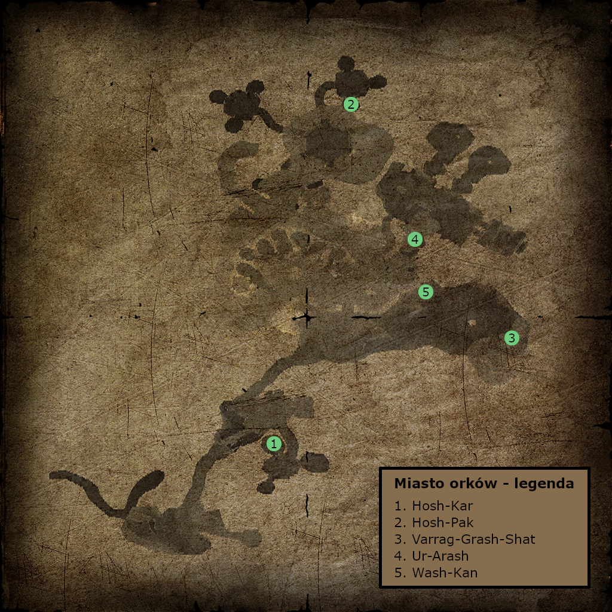

## Powrót do kolonii {#powrot-do-kolonii}

Wraz z Regulusem docieramy do pałacu Zubena. Po rozmowie z władcą pustyni rozmawiamy z Regulusem.

Następnie spotykamy się z nim w Bakareshu. Na miejscu udajemy się do Tizgara w świątyni, po czym rozmawiamy z Amulem i Sigmorem.

Jeśli wykupiliśmy Taigetę, możemy zapytać Tizgara o możliwość zabrania jej do Kolonii. Zgodzi się, więc informujemy ją o tym.

Teraz rozmawiamy z Beliarem i udajemy się do wieży na rytuał. Po jego zakończeniu wracamy do Górniczej Doliny.

Razem z Regulusem udajemy się do naszej kryjówki, gdzie spotykamy Maię walczącą z fanatykami. Po pokonaniu wrogów rozmawiamy z nią, zbieramy kamienie ogniskujące z piedestałów i ruszamy do Saturasa.

W rozmowie mamy wybór: „Udało nam się uciec z Kolonii!” lub „Po prostu miałem coś do zrobienia.”.

Zależnie od wybranej opcji jest inny przebieg zadania [Lekarstwo dla Spiki](#lekarstwo-dla-spiki). Po rozmowie zadanie dobiega końca.

## Zawalenie Starej Kopalni {#zawalenie-starej-kopalni}

**Zleca:** Strażnik bramy

:::info Warunek rozpoczęcia

Wymagane jest wykonanie zadania [Czas na zmiany.](./czesc_i.md#czas-na-zmiany)

:::

Rozmawiamy z Sadalsuudem, następnie z Lee oraz ze strażnikiem bramy w Starym Obozie.

Kolejno udajemy się do Diego, a po rozmowie z nim do Chirona. Następnie wracamy do Lee i ponownie do Chirona, co kończy zadanie.

## Ocaleni {#ocaleni}

**Zleca:** Chiron

:::info Warunek rozpoczęcia

Zadanie dostępne po ukończeniu [Zawalenie Starej Kopalni](#zawalenie-starej-kopalni).

:::

Chiron prosi nas o sprawdzenie, czy ktoś przeżył katastrofę w Starej Kopalni. W tym celu udajemy się do Corristo, który wraz ze swoimi uczniami zgadza się pomóc.

Spotykamy się przy wejściu do kopalni, gdzie okazuje się, że brama jest zamknięta, a kołowrót nie działa. Udajemy się po Homera, który od razu wyrusza z nami. Na miejscu musimy dać mu koło zębate.  To samo, którego używaliśmy do naprawy młynów.

:::tip Wskazówka

Jeśli nie mamy koła, możemy porozmawiać z Okylem, który podpowie, aby zabrać je z placu wymian.

:::

Po naprawie używamy kołowrotu i wchodzimy do kopalni.

W środku rozmawiamy z Drake’iem i Corristo. Mag wręcza nam pierścienie teleportacji dla ocalałych. Przed rozpoczęciem akcji ratunkowej warto porozmawiać z innymi magami.

Możemy uratować łącznie 13 osób: Brandicka, Alepha, Snipesa, Ulberta, Grimesa, Alberto, Iana, orka-niewolnika, Gor Na Vida, Węża, Strażnika, Garpa oraz Ashgana.

:::info Ratunek orka-niewolnika

Orka odnajdziemy w prawym korytarzu na samym dole kopalni. Należy jednak mieć na uwadze, że może się on tam nie pojawić lub zostać zabity od razu przez pełzacze. W tej sytuacji można przywołać go przy pomocy polecenia `insert orc_2001_sklave2`.

:::

Po uratowaniu wszystkich wracamy do Corristo. W trakcie rozmowy pojawia się demon blokujący wyjście.  Magowie zajmują się nim, a my musimy uciekać z kopalni.

Na zewnątrz rozmawiamy z ocalałymi, a następnie wracamy do Chirona, co kończy zadanie.

## Lekarstwo dla Spiki {#lekarstwo-dla-spiki}

**Zleca:** Riordian

**Gdy Saturas NIE wie o wyprawie do Varantu:**

Riordian potrzebuje specjalnej rośliny dla Spiki. Rozmawiamy z Maią i spotykamy się z nią na drodze do górskiej fortecy. Po drodze pokonujemy oddział orków, a w trakcie walki Maia zostaje ciężko ranna. Zabieramy jej lekarstwo i używamy go.

Idąc dalej, Maia skacze z urwiska do wody. Rozmawiamy z nią w wodzie, a potem na brzegu. Następnie kierujemy się w stronę wieży Xardasa.

W tym momencie mamy wybór:

- Możemy spróbować odesłać Maię do Regulusa, jeśli posiadamy pierścień lub runę teleportacji. Sami również udajemy się do Regulusa i odzyskujemy pierścień od Mai. Spotykamy się z nim przy wieży Xardasa obok powalonego drzewa. Następnie prowadzimy go do miejsca, z którego widać roślinę. Regulus zleca nam zadanie [Ulu-Mulu dla Regulusa](#ulu-mulu-dla-regulusa). Po jego wykonaniu spotykamy się ponownie przy wieży obok wioski orków i kontynuujemy wątek [Wioska orków](#wioska-orkow) aż do otwarcia bramy. Regulus pokazuje nam drogę do rośliny. Po jej zdobyciu wracamy do Riordiana. Spika wraca do zdrowia.

- Drugą opcją jest znalezienie pierścienia teleportacji. Nurkujemy przy zatopionej wieży i odnajdujemy go. Wracamy do miejsca, gdzie była Maia, znajdujemy kość i udajemy się do Regulusa. Spotykamy się z nim przy wieży Xardasa i prowadzimy go do miejsca z rośliną. Po rozmowie ruszamy za nim, pokonujemy golemy i wchodzimy do wieży. Regulus wysyła nas do Sharky’ego po solidny topór. Po jego zdobyciu wracamy, Regulus ścina drzewo i wchodzimy do wieży.

W wieży schodzimy niżej i stajemy przed wyborem:

- Możemy przemienić się w krwiopijcę i zdobyć roślinę. Po dostarczeniu jej Riordianowi Spika zostaje uratowana.

- Możemy też wybrać opcję prowadzącą do zadania [Ulu-Mulu dla Regulusa](#ulu-mulu-dla-regulusa). **W tym przypadku Spika umiera.**

**Gdy Saturas WIE o wyprawie do Varantu:**

Do momentu skoku z klifu wszystko przebiega tak samo. Po wyjściu z wody Maia jest w gorszym stanie, więc nurkujemy przy zatopionej wieży i znajdujemy pierścień teleportacji. Używamy go, by przenieść ją do szpitala.

Wracamy do Riordiana, który informuje nas, że teraz potrzebne będą dwie rośliny.

Po pomoc udajemy się do Regulusa i spotykamy się z nim przy brzegu jeziora obok zatopionej wieży. Podążamy za nim aż do zbiornika wodnego, gdzie zleca nam [Ulu-Mulu dla Regulusa](#ulu-mulu-dla-regulusa). Po wykonaniu zadania spotykamy się przy wieży obok wioski orków i kontynuujemy wątek [Wioska orków](#wioska-orkow) aż do zdobycia statuetki.

Przed wioską orków spotykamy Regulusa, który wręcza nam rośliny dla Mai i Spiki. **Wracamy do Riordiana, Maia i Spika nie żyją.**

## Ulu-Mulu dla Regulusa {#ulu-mulu-dla-regulusa}

**Zleca:** Regulus

Aby dostać się do orkowej wioski, potrzebujemy dodatkowego Ulu-Mulu.

Udajemy się do Wolnej Kopalni i rozmawiamy z Ur-Shakiem, który odsyła nas do Tarroka. Po zdobyciu i przyniesieniu wymaganych składników otrzymujemy symbol przyjaźni.

Z Ulu-Mulu wracamy do Regulusa, co kończy zadanie.

## Wioska orków {#wioska-orkow}

**Zleca:** Regulus

:::info Przebieg zadania

Początek zadania może się nieznacznie różnić w zależności od przebiegu [Lekarstwo dla Spiki](#lekarstwo-dla-spiki).

:::

Po dostarczeniu Regulusowi Ulu-Mulu spotykamy się z nim przy wieży za skałą obok wioski orków. Następnie razem udajemy się pod bramę wioski.

Na miejscu musimy odnaleźć orka mówiącego ludzkim głosem. Jest nim Ur-Nammu. Zgodzi się nam pomóc, jeśli przyniesiemy mu skradziony posążek.

Wracamy do Regulusa, a następnie udajemy się do obozu na bagnie i rozmawiamy z Lesterem. Okazuje się, że figurka znajduje się u Y’Beriona. Wchodzimy do środka i ją zabieramy.

:::warning Uwaga

Od tego momentu cały obóz staje się wobec nas wrogi.

:::

Po drodze rozmawiamy jeszcze z Lesterem w jaskini.

Wracamy do Regulusa, oddajemy posążek orkowi i otwieramy bramę do wioski.

Następnie razem z Regulusem udajemy się pod wieżę Xardasa. Klucz do niej posiadają golemy strażnicy. Zabijamy je, zabieramy klucz od lodowego golema i otwieramy drzwi.

W wieży rozmawiamy z demonem, wręczamy mu trzy serca golemów i używamy runy teleportacji. Po rozmowie z Xardasem wracamy do wioski orków.

Teraz rozmawiamy z Regulusem i ruszamy na poszukiwanie dziennika zdradzieckiego paladyna. Sprawdzamy jaskinie. W jednej z nich spotykamy orka, którego musimy poczęstować trucizną. Następnie przeszukujemy komnaty.

Po znalezieniu przedmiotów wracamy do Regulusa i czytamy dziennik. Nagle kraty się zamykają, pojawiają się orkowe szkielety, które musimy pokonać. Przed kratą pojawia się też szaman, z którym rozmawiamy. Trafiamy do lochów.

Rozmawiamy z Regulusem, aż pojawi się orkowy szaman. W rozmowie mamy wybór:

**„To ważne dla nas wszystkich, orku.”**

Ur-Darrag zaprowadzi nas do wodza, który pozwoli wejść do miasta orków. Rozmawiamy z modlącymi się szamanami, zakładamy otrzymany amulet i zabieramy statuetkę. Za jej pomocą otwieramy bramę i rozmawiamy z Regulusem. Przy przejściu do miasta zagada nas Regulus. Zadanie dobiega końca.

**„Jeśli nie chcesz nas wypuścić, wyjdziemy sami.”**

Regulus teleportuje nas z celi. Spotykamy się z nim przed wieżą Xardasa, używamy zwoju i trafiamy pod świątynię Śniącego. Po rozmowie z Regulusem zadanie się kończy.

## Miasto orków {#miasto-orkow}

**Zleca:** Regulus

Jeśli w zadaniu [Wioska orków](#wioska-orkow) uciekliśmy z lochów, pomijamy cały wątek związany z orkami. W takim przypadku po prostu wybijamy mieszkańców miasta. Z ciała przywódcy orków zabieramy klucz i otwieramy kratę prowadzącą do świątyni. Koniec zadania.

Jeśli dostaliśmy się do miasta pokojowo, na moście zagaduje nas Tukash, który kieruje nas do Hosh-Kara. Znajdziemy go za mostem, po prawej stronie, w pomieszczeniu z kuźnią.

Po rozmowie z nim musimy odnaleźć Hosh-Paka. Wracamy do Regulusa, a następnie wyruszamy na poszukiwania Hosh-Paka. Znajdziemy go przy wielkiej arenie - należy zejść na nią po schodach (lub użyć teleportu), a następnie wybrać drugie przejście od prawej. Po rozmowie z nim ponownie wracamy do Regulusa.

Kolejnym krokiem jest spotkanie z Varrag-Grash-Shatem, który odsyła nas do Ur-Arasha. Ten drugi znajduje się w sali tronowej, do której wejście ze strażnikiem znajdziemy po prawej stronie, przechodząc przez główną bramę miasta. Ur-Arash zleca nam trzy zadania: [Orkowe mikstury](#orkowe-mikstury), [Orkowa stal](#orkowa-stal) oraz [Sekta](#sekta).

Po wykonaniu zadań związanych ze stalą i miksturami skupiamy się na zadaniu [Sekta](#sekta) i realizujemy je aż do powrotu do miasta.

Po powrocie Regulus informuje nas, że wódz przekazał klucz i pozwolił wejść do świątyni. Podążamy za Regulusem, otwieramy kratę i przy wejściu do świątyni rozmawiamy z nim, co kończy zadanie.

W przypadków problemów ze znajdywaniem wymienionych wyżej orków, można śmiało posłużyć się niżej załączoną mapą, na której zaznaczono przybliżone pozycje orków potrzebnych do zadań opisanych w solucji.

## Orkowe mikstury {#orkowe-mikstury}

**Zleca:** Ur-Arash

Musimy przynieść Wash-Kanowi 50 wyciągów oraz 50 eliksirów uzdrawiających. Znajdziemy go w pobliżu Varrag-Grash-Shata.

Po dostarczeniu mikstur zadanie dobiega końca.

## Orkowa stal {#orkowa-stal}

**Zleca:** Ur-Arash

Hosh-Kar potrzebuje 50 sztuk stali.

Po przyniesieniu wymaganej ilości zadanie zostaje zakończone.

## Sekta {#sekta}

**Zleca:** Ur-Arash

Ur-Ashar wpuści nas do świątyni dopiero po rozprawieniu się z Obozem Bractwa.

Po wyjściu z miasta orków rozmawiamy z Regulusem. Następnie wieczorem spotykamy się z Lesterem w jaskini przed bagnami. Po rozmowie wracamy do wioski orków i ponownie rozmawiamy z Regulusem.

Razem udajemy się do naszej kryjówki, gdzie na stole znajdujemy notatkę. Czytamy ją. Dowiadujemy się, że Cor Angar przebywa u Cavalorna. Po rozmowie otrzymujemy zadanie [Pomoc dla Y'Beriona](#pomoc-dla-yberiona).

Udajemy się na bagna, gdzie Angar zleca nam [Lecznicze zioła dla Y'Beriona](#lecznicze-ziola-dla-yberiona). Po wykonaniu zadania wracamy do Regulusa, którego znajdziemy przy orkowej lampie na bagnach.

Regulus każe nam przeszukać laboratorium Cor Kaloma. Obok laboratorium znajdujemy notatkę, którą przynosimy Regulusowi. Po jej przeczytaniu pojawia się miniatura Śniącego. Pokonujemy ją.

Wracamy do Y'Beriona i rozmawiamy z nim, Angarem oraz Regulusem. Następnie udajemy się na cmentarzysko orków.

Na miejscu spotykamy Baal Lukora i prowadzimy go do Varrag-Nag-Daha. Po krótkiej scenie wracamy do Cor Angara, a następnie rozmawiamy z Y'Berionem.

Wracamy do miasta orków i rozmawiamy z Regulusem. Przy pierwszym wejściu do świątyni nie spotykamy Cor Kaloma. Przy drugim zatrzymuje nas Tukash przy wejściu do miasta orków i informuje, że ktoś dostał się do środka świątyni. Udajemy się do wodza orków.

Zadanie kończy się w momencie pokonania Cor Kaloma i jego popleczników w świątyni.

## Pomoc dla Y'Beriona {#pomoc-dla-yberiona}

**Zleca:** Cor Angar

Zadanie informacyjne powiązane z [Lecznicze zioła dla Y'Beriona](#lecznicze-ziola-dla-yberiona).

## Lecznicze zioła dla Y'Beriona {#lecznicze-ziola-dla-yberiona}

**Zleca:** Cor Angar

Cor Angar prosi nas o przyniesienie ziół dla Y'Beriona.

:::warning Uwaga

Możemy po prostu je dostarczyć, jednak wtedy Y'Berion umrze.

:::

Lepszym rozwiązaniem jest udanie się do Fortuno, którego znajdziemy w laboratorium Cor Kaloma. Opowie nam o specjalnej miksturze, do której potrzebna jest roślina o nazwie Mroczna Tajemnica.

Po jej zdobyciu mamy dwie możliwości. Jeśli znamy się na alchemii, otrzymamy recepturę i sami warzymy miksturę. W przeciwnym razie przygotuje ją Fortuno.

Z gotową miksturą wracamy do Cor Angara, co kończy zadanie i pozwala uratować Y'Beriona.

## Świątynia Śniącego {#swiatynia-sniacego}

Zadanie ma liniowy przebieg, a wszystkie rozwiązania zagadek znajdują się w dzienniku.

:::warning Uwaga

Po zjechaniu windą na dół do zalanego pomieszczenia z Regulusem i przekręceniu przełączników może okazać się, że krata blokująca przejście do wielkiego mostu się nie podniesie. Należy to zignorować i przenieść naszą postać oraz Regulusa na drugą stronę kraty.

:::

## Magiczny miecz URIZIEL {#magiczny-miecz-uriziel}

Wraz z Regulusem pokazujemy Uriziel Xardasowi. Ten wręcza nam klucz do skrzyni w swojej zatopionej wieży.

Udajemy się tam i znajdujemy pancerz z magicznej rudy. Następnie wracamy do Xardasa, który daje nam zwój transferu energii.

:::warning Uwaga

Można spotkać się z błędem, w wyniku którego pancerza nie ma w skrzyni. Należy wtedy użyć polecenia `insert ore_armor_m` i podnieść zbroję, po czym Regulus nas zaczepi i wróci do wieży Xardasa.

:::

Rozmawiamy z Saturasem, jednak ten odmawia pomocy. W związku z tym udajemy się do Sadalsuuda, który zgadza się nam pomóc.

Spotykamy się z nim przy kopcu rudy, gdzie dochodzi do naładowania miecza.

Po wszystkim wracamy do Regulusa, który czeka w karczmie na jeziorze.

:::tip Wskazówka

Warto odwiedzić Golema na arenie, który wzmocni nam pancerz. Natomiast Grah-Shat, który mieszka w górach w pobliżu Wolnej Kopalni, wręczy nam hełm z magicznej rudy.

:::

## Powrót do świątyni {#powrot-do-swiatyni}

Po naładowaniu Uriziela możemy wraz z Regulusem wrócić do świątyni. Rozmawiamy z nim w karczmie na jeziorze i spotykamy się przed wejściem.

Dalszy przebieg zadania jest liniowy, więc nie wymaga szczegółowego opisu.

:::warning Uwaga

Jeżeli Regulus zginie podczas walki ze Śniącym, należy wczytać ostatni zapis lub go wskrzesić, ponieważ jego śmierć uniemożliwia ukończenie modyfikacji.

:::

---

:::info Informacja

Po ostatecznym pokonaniu Śniącego kończymy modyfikację.  
**Gratulacje! :tada:**

:::
